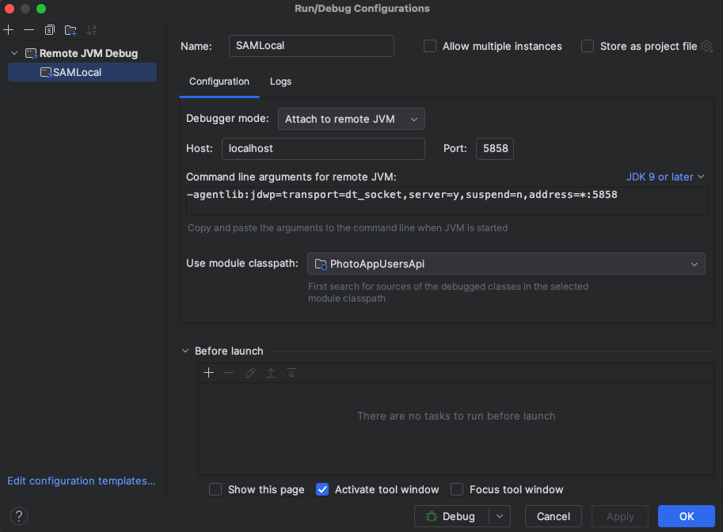
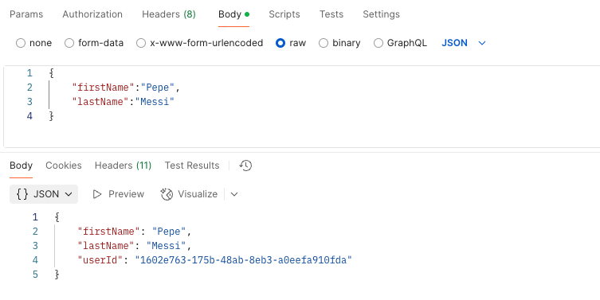
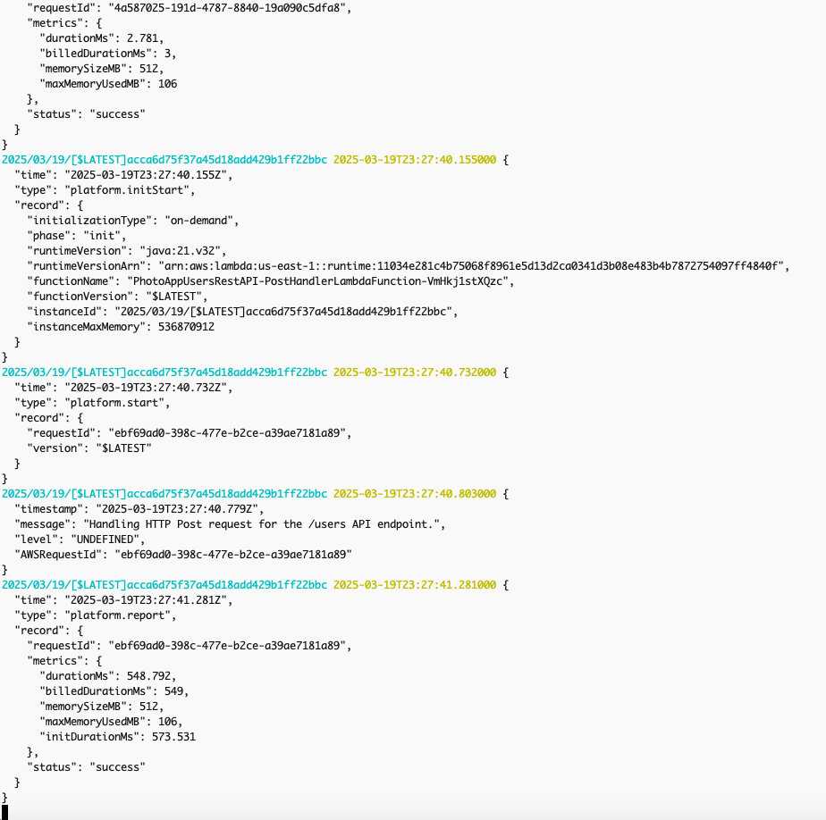

# AWS-Serverless-for-Java-Developers
AWS Serverless for Java Developers

# REST API

REST API, or Representational State Transfer API, is a type of application programming interface (API) that uses a software architecture to manage communication between applications. REST APIs are often used for mobile app development and the Internet of Things (IoT). 

### How does REST API work?
REST APIs use standard HTTP methods to access resources using URLs. 
REST APIs are stateless, meaning each request needs to include all the information needed to process it. 
REST APIs are client-server, meaning the sender and receiver are independent of each other. 
REST APIs use a uniform interface, meaning all requests for the same resource look the same. 
REST APIs are cacheable, meaning API responses can be cached on the client or server side. 

### Benefits of REST APIs 

REST APIs are easier to use than other protocols like SOAP.
REST APIs are faster and more lightweight.
REST APIs are highly scalable.
REST APIs are cross-platform portable.
REST APIs are easy to implement and modify.tr


## HTTP verbs

The most commonly used HTTP verbs are POST, GET, PUT, PATCH, and DELETE. These verbs are also known as HTTP methods. They correspond to the operations of create, read, update, and delete (CRUD). 

### Explanation

- POST: Used to request that a web server accept data from a request message. This is often used to upload a file or submit a web form. 
- GET: Used to read data. 
- PUT: Used to update data. 
- PATCH: Used to update data. 
- DELETE: Used to delete data. 
- OPTIONS: Used to find out which HTTP methods are allowed for a resource. The server responds with a list of supported methods. 


## REST API discovery

REST API discovery is the process of identifying all REST APIs in a system. It's the first step in managing and securing APIs. 

### How it works

Discovery tools catalog all APIs, including public and internal APIs 
Discovery tools search for APIs that can perform specific functions 
Discovery tools provide information about APIs, including what they do, what data they access, and how to access them 

### Discovery tools

Google API Discovery Service
Provides discovery documents for most APIs, including API descriptions, resource schemas, and authentication scopes 
SoapUI
Captures REST traffic, which can be filtered and converted into services for use in projects 
AWS Application Discovery Service
Allows users to specify filters and consult elements of configuration for server assets 

### Benefits of discovery

Discovery helps developers understand the APIs used by an organization, which can help them identify and better use those APIs. 

## Amazon API Gateway

Amazon API Gateway is a service that helps developers create, manage, and secure APIs. It acts as an entry point for applications to access data and functionality from backend services. 

### Features 

API creation: Create RESTful and WebSocket APIs
API management: Manage APIs, including traffic management, authorization, and monitoring
API security: Secure APIs with authentication and authorization controls
API scaling: Run multiple versions of an API simultaneously
API support: Support containerized and serverless workloads, as well as web applications

### Benefits

Developers can focus on building application logic instead of worrying about infrastructure 
APIs can serve traffic over the internet or can be accessible only within your VPC 
APIs can be used to connect non-AWS applications to AWS back-end resources 

## AWS SAM - AWS Serverless Application Model

AWS Serverless Application Model (AWS SAM) is an open-source framework that helps developers build and run serverless applications on AWS. It uses infrastructure as code (IaC) to define resources like databases, APIs, and event source mappings. 

### Features

- Shorthand syntax: Uses a shorthand syntax to declare resources in YAML 
- Templates: Includes pre-built application templates for common use cases 
- Command-line interface: Includes a command-line interface (CLI) tool for building, packaging, and testing applications 
- CI/CD integration: Integrates with popular CI/CD tools for production-ready deployments 
- Local and cloud testing: Allows developers to test applications locally or use SAM Accelerate for cloud testing 


### template.yml

- Create new application.
- Build.
- Invoke locally.
- Debug.
- Deploy.
- View remote log files.


### Installing AWS Serverless Application Model - SAM (macOS)

```terminal
> which sam
/usr/local/bin/sam

> sam --version
SAM CLI, version 1.135.0
```

Reference to install: [docs.aws.amazon.com]([Installing](https://docs.aws.amazon.com/es_es/serverless-application-model/latest/developerguide/install-sam-cli.html))

## AWS CLI

```terminal
> which aws
/usr/local/bin/aws

> aws --version
aws-cli/2.24.26 Python/3.12.9 Darwin/24.3.0 exe/x86_64
```

### AWS Configure CLI

```terminal
carlosandresmartinez@Carloss-Mac-mini AWS-Serverless-for-Java-Developers % aws configure
AWS Access Key ID [None]: Paste AWS Access Key ID
AWS Secret Access Key [None]: Paste AWS Secret Access Key
Default region name [None]: us-east-1
Default output format [None]: Default is JSON, press enter
```

[AWS CLI](https://docs.aws.amazon.com/cli/latest/userguide/cli-chap-welcome.html)

## Let's go to practice, create new project with SAM

### Init sam project with the next command, and answer the next questions

```terminal
> sam init

SAM CLI now collects telemetry to better understand customer needs.

You can OPT OUT and disable telemetry collection by setting the
environment variable SAM_CLI_TELEMETRY=0 in your shell.
Thanks for your help!

Learn More: https://docs.aws.amazon.com/serverless-application-model/latest/developerguide/serverless-sam-telemetry.html


You can preselect a particular runtime or package type when using the `sam init` experience.
Call `sam init --help` to learn more.

Which template source would you like to use?
	1 - AWS Quick Start Templates
	2 - Custom Template Location
Choice: 1

Choose an AWS Quick Start application template
	1 - Hello World Example
	2 - Data processing
	3 - Hello World Example with Powertools for AWS Lambda
	4 - Multi-step workflow
	5 - Scheduled task
	6 - Standalone function
	7 - Serverless API
	8 - Infrastructure event management
	9 - Lambda Response Streaming
	10 - GraphQLApi Hello World Example
	11 - Full Stack
	12 - Lambda EFS example
	13 - Serverless Connector Hello World Example
	14 - Multi-step workflow with Connectors
	15 - DynamoDB Example
	16 - Machine Learning
Template: 1

Use the most popular runtime and package type? (python3.13 and zip) [y/N]: N

Which runtime would you like to use?
	1 - dotnet8
	2 - dotnet6
	3 - go (provided.al2)
	4 - go (provided.al2023)
	5 - graalvm.java11 (provided.al2)
	6 - graalvm.java17 (provided.al2)
	7 - java21
	8 - java17
	9 - java11
	10 - java8.al2
	11 - nodejs22.x
	12 - nodejs20.x
	13 - nodejs18.x
	14 - python3.9
	15 - python3.13
	16 - python3.12
	17 - python3.11
	18 - python3.10
	19 - ruby3.3
	20 - ruby3.2
	21 - rust (provided.al2)
	22 - rust (provided.al2023)
Runtime: 7

What package type would you like to use?
	1 - Zip
	2 - Image
Package type: 1

Which dependency manager would you like to use?
	1 - gradle
	2 - maven
Dependency manager: 2

Would you like to enable X-Ray tracing on the function(s) in your application?  [y/N]: N

Would you like to enable monitoring using CloudWatch Application Insights?
For more info, please view https://docs.aws.amazon.com/AmazonCloudWatch/latest/monitoring/cloudwatch-application-insights.html [y/N]: y
AppInsights monitoring may incur additional cost. View https://docs.aws.amazon.com/AmazonCloudWatch/latest/monitoring/appinsights-what-is.html#appinsights-pricing for more details

Would you like to set Structured Logging in JSON format on your Lambda functions?  [y/N]: y
Structured Logging in JSON format might incur an additional cost. View https://docs.aws.amazon.com/lambda/latest/dg/monitoring-cloudwatchlogs.html#monitoring-cloudwatchlogs-pricing for more details

Project name [sam-app]: photo-app-users-rest-api-sam

Cloning from https://github.com/aws/aws-sam-cli-app-templates (process may take a moment)

    -----------------------
    Generating application:
    -----------------------
    Name: photo-app-users-rest-api-sam
    Runtime: java21
    Architectures: x86_64
    Dependency Manager: maven
    Application Template: hello-world
    Output Directory: .
    Configuration file: photo-app-users-rest-api-sam/samconfig.toml

    Next steps can be found in the README file at photo-app-users-rest-api-sam/README.md


Commands you can use next
=========================
[*] Create pipeline: cd photo-app-users-rest-api-sam && sam pipeline init --bootstrap
[*] Validate SAM template: cd photo-app-users-rest-api-sam && sam validate
[*] Test Function in the Cloud: cd photo-app-users-rest-api-sam && sam sync --stack-name {stack-name} --watch
```

### Build sam project

Once the project is created typing the next command.

```terminal
> sam build
Starting Build use cache
Cache is invalid, running build and copying resources for following functions (PostHandlerLambdaFunction)
Building codeuri:
/******/*****/***/*************/******************/photo-app-users-rest-api-sam
/PhotoAppUsersApi runtime: java21 architecture: x86_64 functions: PostHandlerLambdaFunction
/opt/homebrew/bin/mvn is using a JVM with major version 23 which is newer than 21 that is supported by AWS Lambda. The compiled
function code may not run in AWS Lambda unless the project has been configured to be compatible with Java 21 using
'maven.compiler.target' in Maven.
 Running JavaMavenWorkflow:CopySource
 Running JavaMavenWorkflow:MavenBuild
 Running JavaMavenWorkflow:MavenCopyDependency
 Running JavaMavenWorkflow:MavenCopyArtifacts
 Running JavaMavenWorkflow:CleanUp
 Running JavaMavenWorkflow:JavaCopyDependencies

Build Succeeded

Built Artifacts  : .aws-sam/build
Built Template   : .aws-sam/build/template.yaml

Commands you can use next
=========================
[*] Validate SAM template: sam validate
[*] Invoke Function: sam local invoke
[*] Test Function in the Cloud: sam sync --stack-name {{stack-name}} --watch
[*] Deploy: sam deploy --guided
```

### Invoke local sam project 

Note: Before running the following command, validate that Docker is running.

```terminal
> sam local invoke PostHandlerLambdaFunction --event events/event.json
Invoking com.example.aws.photoapp.users.PostHandler::handleRequest (java21)
Local image was not found.
Removing rapid images for repo public.ecr.aws/sam/emulation-java21
Building image..........................................................................
Using local image: public.ecr.aws/lambda/java:21-rapid-x86_64.

Mounting /Users/carlosandresmartinez/Documents/DEV/CloudComputer/AWS/Serverless/AWS-Serverless-for-Java-Developers/photo-app-users-rest-api-sam/.aws-sam/build/PostHandlerLambdaFunction as
/var/task:ro,delegated, inside runtime container
START RequestId: 5064acb5-ddc6-4b52-8331-f4b62f3c4f4f Version: $LATEST
END RequestId: 3881791b-d87b-4b93-9074-94d4f903242d
REPORT RequestId: 3881791b-d87b-4b93-9074-94d4f903242d	Init Duration: 0.26 ms	Duration: 679.27 ms	Billed Duration: 680 ms	Memory Size: 512 MB	Max Memory Used: 512 MB
{"statusCode": 200, "headers": {"Content-Type": "application/json"}, "body": "{\"firstName\":\"carlos\",\"lastName\":\"martinez\",\"userId\":\"abe89f46-823a-47df-bc0a-9d8f513299f9\"}"}
```

### Debug mode 

How to start in debug mode in sam project ? Execute the next command.

```terminal 
> sam local invoke PostHandlerLambdaFunction --event events/event.json -d 5858
Invoking com.example.aws.photoapp.users.PostHandler::handleRequest (java21)
Local image is up-to-date
Using local image: public.ecr.aws/lambda/java:21-rapid-x86_64.

Mounting /Users/carlosandresmartinez/Documents/DEV/CloudComputer/AWS/Serverless/AWS-Serverless-for-Java-Developers/photo-app-users-rest-api-sam/.aws-sam/build/PostHandlerLambdaFunction as
/var/task:ro,delegated, inside runtime container
START RequestId: 04a1200d-a4e8-49b2-934f-9fc354eb82d9 Version: $LATEST
Picked up _JAVA_OPTIONS: -agentlib:jdwp=transport=dt_socket,server=y,suspend=y,quiet=y,address=*:5858 -XX:MaxHeapSize=2834432k -XX:+UseSerialGC -XX:+TieredCompilation -XX:TieredStopAtLevel=1 -Djava.net.preferIPv4Stack=true
END RequestId: 5b6b759a-b7d7-468b-96e9-74eb4d7f045c
REPORT RequestId: 5b6b759a-b7d7-468b-96e9-74eb4d7f045c	Init Duration: 0.24 ms	Duration: 349971.42 ms	Billed Duration: 349972 ms	Memory Size: 512 MB	Max Memory Used: 512 MB
{"statusCode": 200, "headers": {"Content-Type": "application/json"}, "body": "{\"firstName\":\"carlos\",\"lastName\":\"martinez\",\"userId\":\"6e52b71b-a831-45ac-af72-3402bc96ea7d\"}"}
```

### Debug configurations intellij



### Deploy sam project

```terminal 
> sam deploy --guided

Configuring SAM deploy
======================

	Looking for config file [samconfig.toml] :  Found
	Reading default arguments  :  Success

	Setting default arguments for 'sam deploy'
	=========================================
	Stack Name [photo-app-users-rest-api-sam]: PhotoAppUsersRestAPI
	AWS Region [us-east-1]:
	#Shows you resources changes to be deployed and require a 'Y' to initiate deploy
	Confirm changes before deploy [Y/n]: Y
	#SAM needs permission to be able to create roles to connect to the resources in your template
	Allow SAM CLI IAM role creation [Y/n]: Y
	#Preserves the state of previously provisioned resources when an operation fails
	Disable rollback [y/N]: y
	PostHandlerLambdaFunction has no authentication. Is this okay? [y/N]: y
	Save arguments to configuration file [Y/n]: Y
	SAM configuration file [samconfig.toml]:
	SAM configuration environment [default]:

	Looking for resources needed for deployment:
	Creating the required resources...
	Successfully created!

	Managed S3 bucket: aws-sam-cli-managed-default-samclisourcebucket-tn4afptmyrcv
	A different default S3 bucket can be set in samconfig.toml and auto resolution of buckets turned off by setting resolve_s3=False

	Saved arguments to config file
	Running 'sam deploy' for future deployments will use the parameters saved above.
	The above parameters can be changed by modifying samconfig.toml
	Learn more about samconfig.toml syntax at
	https://docs.aws.amazon.com/serverless-application-model/latest/developerguide/serverless-sam-cli-config.html

	Uploading to PhotoAppUsersRestAPI/574e372235e779dedb7c43d0d197c748  1142190 / 1142190  (100.00%)

	Deploying with following values
	===============================
	Stack name                   : PhotoAppUsersRestAPI
	Region                       : us-east-1
	Confirm changeset            : True
	Disable rollback             : True
	Deployment s3 bucket         : aws-sam-cli-managed-default-samclisourcebucket-tn4afptmyrcv
	Capabilities                 : ["CAPABILITY_IAM"]
	Parameter overrides          : {}
	Signing Profiles             : {}

Initiating deployment
=====================

	Uploading to PhotoAppUsersRestAPI/ab678e58cec260889c50e74cfdd5e3c8.template  1386 / 1386  (100.00%)


Waiting for changeset to be created..

CloudFormation stack changeset
-----------------------------------------------------------------------------------------------------------------------------------------------------------------------------------------
Operation                                      LogicalResourceId                              ResourceType                                   Replacement
-----------------------------------------------------------------------------------------------------------------------------------------------------------------------------------------
+ Add                                          PostHandlerLambdaFunctionPhotoAppUsersPermis   AWS::Lambda::Permission                        N/A
                                               sionProd
+ Add                                          PostHandlerLambdaFunctionRole                  AWS::IAM::Role                                 N/A
+ Add                                          PostHandlerLambdaFunction                      AWS::Lambda::Function                          N/A
+ Add                                          ServerlessRestApiDeployment882ab90343          AWS::ApiGateway::Deployment                    N/A
+ Add                                          ServerlessRestApiProdStage                     AWS::ApiGateway::Stage                         N/A
+ Add                                          ServerlessRestApi                              AWS::ApiGateway::RestApi                       N/A
-----------------------------------------------------------------------------------------------------------------------------------------------------------------------------------------


Changeset created successfully. arn:aws:cloudformation:us-east-1:439994147280:changeSet/samcli-deploy1742425514/16c101dd-9f82-4ece-a746-267d1da4fbb6


Previewing CloudFormation changeset before deployment
======================================================
Deploy this changeset? [y/N]: y

2025-03-19 18:05:26 - Waiting for stack create/update to complete

CloudFormation events from stack operations (refresh every 5.0 seconds)
-----------------------------------------------------------------------------------------------------------------------------------------------------------------------------------------
ResourceStatus                                 ResourceType                                   LogicalResourceId                              ResourceStatusReason
-----------------------------------------------------------------------------------------------------------------------------------------------------------------------------------------
CREATE_IN_PROGRESS                             AWS::CloudFormation::Stack                     PhotoAppUsersRestAPI                           User Initiated
CREATE_IN_PROGRESS                             AWS::IAM::Role                                 PostHandlerLambdaFunctionRole                  -
CREATE_IN_PROGRESS                             AWS::IAM::Role                                 PostHandlerLambdaFunctionRole                  Resource creation Initiated
CREATE_COMPLETE                                AWS::IAM::Role                                 PostHandlerLambdaFunctionRole                  -
CREATE_IN_PROGRESS                             AWS::Lambda::Function                          PostHandlerLambdaFunction                      -
CREATE_IN_PROGRESS                             AWS::Lambda::Function                          PostHandlerLambdaFunction                      Resource creation Initiated
CREATE_COMPLETE                                AWS::Lambda::Function                          PostHandlerLambdaFunction                      -
CREATE_IN_PROGRESS                             AWS::ApiGateway::RestApi                       ServerlessRestApi                              -
CREATE_IN_PROGRESS                             AWS::ApiGateway::RestApi                       ServerlessRestApi                              Resource creation Initiated
CREATE_COMPLETE                                AWS::ApiGateway::RestApi                       ServerlessRestApi                              -
CREATE_IN_PROGRESS                             AWS::ApiGateway::Deployment                    ServerlessRestApiDeployment882ab90343          -
CREATE_IN_PROGRESS                             AWS::Lambda::Permission                        PostHandlerLambdaFunctionPhotoAppUsersPermis   -
                                                                                              sionProd
CREATE_IN_PROGRESS                             AWS::Lambda::Permission                        PostHandlerLambdaFunctionPhotoAppUsersPermis   Resource creation Initiated
                                                                                              sionProd
CREATE_IN_PROGRESS                             AWS::ApiGateway::Deployment                    ServerlessRestApiDeployment882ab90343          Resource creation Initiated
CREATE_COMPLETE                                AWS::Lambda::Permission                        PostHandlerLambdaFunctionPhotoAppUsersPermis   -
                                                                                              sionProd
CREATE_COMPLETE                                AWS::ApiGateway::Deployment                    ServerlessRestApiDeployment882ab90343          -
CREATE_IN_PROGRESS                             AWS::ApiGateway::Stage                         ServerlessRestApiProdStage                     -
CREATE_IN_PROGRESS                             AWS::ApiGateway::Stage                         ServerlessRestApiProdStage                     Resource creation Initiated
CREATE_COMPLETE                                AWS::ApiGateway::Stage                         ServerlessRestApiProdStage                     -
CREATE_COMPLETE                                AWS::CloudFormation::Stack                     PhotoAppUsersRestAPI                           -
-----------------------------------------------------------------------------------------------------------------------------------------------------------------------------------------

CloudFormation outputs from deployed stack
--------------------------------------------------------------------------------------------------------------------------------------------------------------------------------------------
Outputs
--------------------------------------------------------------------------------------------------------------------------------------------------------------------------------------------
Key                 PhotoAppUsersApi
Description         API Gateway endpoint URL for Prod stage for create a new User
Value               https://pvoyvu49w2.execute-api.us-east-1.amazonaws.com/Prod/hello/

Key                 PostHandlerLambdaFunction
Description         PostHandler Lambda Function ARN
Value               arn:aws:lambda:us-east-1:439994147280:function:PhotoAppUsersRestAPI-PostHandlerLambdaFunction-VmHkj1stXQzc

Key                 PostHandlerLambdaFunctionIamRole
Description         Implicit IAM Role created for PostHandlerLambdaFunction function
Value               arn:aws:iam::439994147280:role/PhotoAppUsersRestAPI-PostHandlerLambdaFunctionRole-lcLqv1PgueSN
--------------------------------------------------------------------------------------------------------------------------------------------------------------------------------------------
```

### Test from postman 



### Show logs 

```terminal
> sam logs --name PostHandlerLambdaFunction --stack-name PhotoAppUsersRestAPI
```

### Delete sam project

```terminal
> sam delete photo-app-users-rest-api-sam
	Are you sure you want to delete the stack PhotoAppUsersRestAPI in the region us-east-1 ? [y/N]: y
	Are you sure you want to delete the folder PhotoAppUsersRestAPI in S3 which contains the artifacts? [y/N]: y
        - Deleting S3 object with key PhotoAppUsersRestAPI/2687d1b24784b8d29d047d3dd7ca4f8a
        - Deleting S3 object with key PhotoAppUsersRestAPI/574e372235e779dedb7c43d0d197c748
        - Deleting S3 object with key PhotoAppUsersRestAPI/7984d12e3203235971046efda61553cc.template
        - Deleting S3 object with key PhotoAppUsersRestAPI/a9dc1ec7b22baf0633c7d0ffef924335.template
        - Deleting S3 object with key PhotoAppUsersRestAPI/ab678e58cec260889c50e74cfdd5e3c8.template
	- Deleting Cloudformation stack PhotoAppUsersRestAPI

Deleted successfully
```
Look screenshot of logs


## IAM - AWS Identity and Access Management

AWS Identity and Access Management (IAM) is a web service that controls who can access AWS resources. It also manages permissions for those resources. 
What IAM does Controls who can sign in to AWS, Controls who has permission to use AWS resources, Manages workload and workforce access, and Keeps data safe. 
How IAM works 
Users are individuals or applications that need access to AWS resources
Groups are collections of users
Roles are entities that can be assumed by anyone who needs them
Benefits of IAM Prevents unauthorized access to AWS resources, Prevents unauthorized changes to AWS configurations, Prevents unauthorized deletion of AWS resources, and Prevents unauthorized access to sensitive data. 
IAM features 
Password policy
Multifactor authentication (MFA)
Auto-administration of MFA
Updating credentials
Viewing the last access information to the service of Organizations for a policy
Applying limited managed policies


